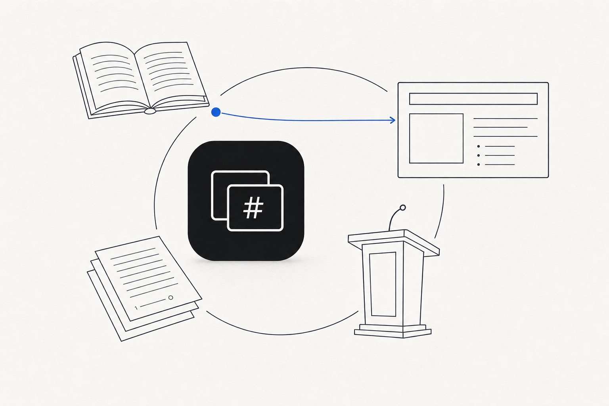

<p align="center">
  
</p>

<h1 align="center">Lecture Studio</h1>

<p align="center">
  A native macOS app for teachers and speakers who write slide decks from their reading sources.<br>
  Decks are <a href="https://marp.app">Marp</a> Markdown in a folder you own; the writing assistant runs on <a href="https://oberik.com">Oberik</a>.
</p>

<p align="center">
  <a href="https://lecture.studio">lecture.studio</a> ·
  <a href="https://lecture.studio/download/">Download</a> ·
  <a href="https://lecture.studio/setup/oberik/">Oberik setup guide</a> ·
  <a href="https://lecture.studio/blog/">Guides</a>
</p>

---

Lecture Studio opens a git repository of courses and talks. You drop readings, papers, notes, and old slides into
a `sources/` folder, ask for an outline, and get a Marp deck that cites those sources. Then speaker notes, practice
questions, and an instructor guide. Everything stays as plain files on disk, so the decks work with any Marp
toolchain and any editor.

- **Decks are Markdown.** One `.md` file per deck, rendered live with Marp Core. Export to PDF or PowerPoint with
  [marp-cli](https://github.com/marp-team/marp-cli) or any Marp tool.
- **Every claim cites a source.** Sources are indexed per course and per unit; the assistant searches them and
  cites them under the answer instead of writing from memory.
- **Notes, questions, guide.** Speaker notes slide by slide, retrieval questions, and an instructor guide from the
  same conversation.
- **Courses across terms.** A course is a folder of numbered units. New terms copy the old one and redate it;
  terms can be compared unit by unit.
- **Presenter mode.** Audience window plus a presenter window with notes, the next slide, and a break countdown.
- **Overflow scan.** "Check slides" renders every slide and flags text past the slide edge and missing images.
- **Your files, your folder.** The app reads and writes a folder you choose. Commit, push, and pull from the git
  bar; nothing is stored in a cloud by the app.

## Requirements

- macOS 15 Sequoia or later on Apple silicon.
- An [Oberik](https://oberik.com) project for the assistant (free to create; the assistant bills through the model
  provider you attach). The app works without it as a Marp editor and viewer.

## Install

Download the DMG from the [Releases](https://github.com/ekremcet/lecture-studio/releases/latest) page or from
[lecture.studio/download](https://lecture.studio/download/), drag **Lecture Studio** into Applications, and open it.

The current builds are signed with an Apple Developer ID but not yet notarized, so macOS blocks the first launch.
Try to open the app once, then go to **System Settings → Privacy & Security**, scroll to the message about
Lecture Studio, and click **Open Anyway**. Later releases will be notarized.

Verify a download with:

```
shasum -a 256 ~/Downloads/LectureStudio-<version>.dmg
```

The checksum of each release is listed on its release page.

## Connect the assistant

1. Create a project on [oberik.com](https://oberik.com/signup) and attach a model provider key. Oberik asks for a
   chat model and an embedding model.
2. Apply the project setup from a checkout of this repository. It sets the system prompt, the capabilities, the
   app's origin, and uploads the skill pack:

   ```
   npm install
   cp .env.example .env        # fill in OBERIK_PROJECT_ID and OBERIK_PROJECT_KEY
   npm run oberik:setup -- --dry
   npm run skills:publish
   ```

3. In the app, open **Settings (⌘,) → Agent**, paste the project id and key, and press **Test connection**.

The step-by-step version with screenshots is at [lecture.studio/setup/oberik](https://lecture.studio/setup/oberik/).
The app never sends the project key to a web view; it mints short-lived tokens in Swift and hands those to the
hidden agent page, which runs under the origin `http://127.0.0.1:3005`.

## Build from source

You need Xcode 16 or later (Swift 6 toolchain) and Node.js 20 or later.

```
git clone https://github.com/ekremcet/lecture-studio.git
cd lecture-studio
scripts/build.sh          # bundles the JS core into Sources/LectureStudio/Resources, then swift build
swift run                 # launches the app
swift test                # StudioCore unit tests
```

`scripts/build.sh -c release` makes a release build. Open `Package.swift` in Xcode to work on the Swift side;
run `npm run web:watch` while you work on the TypeScript side.

## Project layout

| Path | What it is |
|---|---|
| `Sources/StudioCore` | Foundation-only library: repo access, course and term metadata, templates, scaffolds, file index, sources, git, Oberik control plane. Unit-tested. |
| `Sources/LectureStudio` | The SwiftUI app: pickers, workspace, chat, presenter mode, git bar, sheets, settings. |
| `Tests/StudioCoreTests` | Tests for `StudioCore`. |
| `web-core/` | The browser-side core (Marp render, overflow scan, CodeMirror editor, Oberik agent bridge), bundled with esbuild into three `WKWebView` pages. |
| `themes/` | The Marp themes the app ships: `ytu-lecture` and `ytu-talk`. |
| `skill-pack/` | The Agent Skills plugin the assistant runs with, plus the system prompt. Uploaded to your Oberik project by `npm run skills:publish`. |
| `scripts/` | `build.sh`, `package.sh` (signed DMG, optional notarization), `oberik-setup.ts` (project setup as code), `build-skill-pack.sh`, `make-icon.sh`. |
| `Packaging/` | `Info.plist`, entitlements, and the app icon. |

## The material repository

Any folder that is a git repository works. The app reads and writes this layout:

```
studio.json                 presenter profile (name, contact lines, language, teaching style)
sources/                    shared sources, searched in every conversation
<course>/                   one course: studio.json, syllabus.md, AGENTS.md, sources/
<course>/week3/             one unit: week3-slides.md, week3-instructor-guide.md, assets/, sources/
<talk>/                     one talk: <talk>.md, assets/, sources/, studio.json with kind "talk"
```

The unit word is per course (`week`, `session`, `module`, `lecture`, `day`, or `part`). Existing folders keep
their names.

## Releases

Releases are built with `scripts/package.sh <version>`: release build, `.app` bundle, Developer ID signature with
the hardened runtime, DMG, and, when `NOTARY_PROFILE` names a notarytool keychain profile, notarization and
stapling. The script writes `dist/LectureStudio-<version>.dmg` and an unversioned `dist/LectureStudio.dmg` for the
stable download link, and prints the SHA-256. Both files are attached to the GitHub release.

## Contributing

Issues and pull requests are welcome. Keep the Swift side in Swift 5 language mode (the package sets it), run
`swift test` before a pull request, and keep the JS bundle self-contained under `web-core/`.

## License

To be decided before the first public release. Until a `LICENSE` file is added, all rights are reserved.
